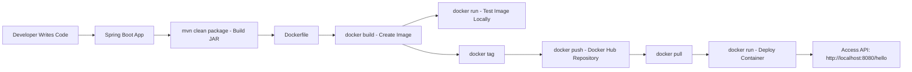

# 🚀 Docker Demo — Spring Boot + Docker
A simple **Spring Boot REST API** packaged and deployed using **Docker**. This project demonstrates how to build, containerize, push, and run a Java application using Docker.

---

## 📷 Project Screenshots
(Add your images in the `screenshots/` folder)
- ``
- ``
- ``
- ``
- ``

---

## 🧩 Architecture Diagram


---

## 📦 Project Overview
This project contains:
- A simple Spring Boot REST API
- Dockerfile to containerize the application
- Steps to build, tag, push, and run the Docker container

### ✔ REST Controller
```java
package com.praveen.docker_demo;

import org.springframework.web.bind.annotation.GetMapping;
import org.springframework.web.bind.annotation.RestController;

@RestController
public class DockerDemoController {
    @GetMapping("/dockerDemo")
    public String getDemo() {
        return "Spring Boot App is Dockerized successfully";
    }
}

```

---

## 🐳 Docker Setup Instructions

### **1. Build the JAR**
```sh
mvn clean package
```

### **2. Build Docker Image**
```sh
C:\Users\prave\Downloads\docker-demo\docker-demo>docker build .
C:\Users\prave\Downloads\docker-demo\docker-demo>docker images
REPOSITORY            TAG       IMAGE ID       CREATED         SIZE
<none>                <none>    2dfd3c8e5383   5 minutes ago   744MB
mongo                 7.0       542095b95175   13 days ago     1.13GB
mongo                 latest    7245ffb851d1   13 days ago     1.24GB
testcontainers/ryuk   0.11.0    2eaec4fc2cf1   13 months ago   28.3MB

```

### **3. Tag the Image**
```sh
In this stage we have to change empty <none> tag to docker-demo-image1:tag1—this is a name of the tag & image
C:\Users\prave\Downloads\docker-demo\docker-demo>docker build -t docker-demo-image1:tag1 .
C:\Users\prave\Downloads\docker-demo\docker-demo>docker images
REPOSITORY            TAG       IMAGE ID       CREATED          SIZE
docker-demo-image1    tag1      b4fa24032ab0   15 minutes ago   744MB
<none>                <none>    2dfd3c8e5383   15 minutes ago   744MB
mongo                 7.0       542095b95175   13 days ago      1.13GB
mongo                 latest    7245ffb851d1   13 days ago      1.24GB
testcontainers/ryuk   0.11.0    2eaec4fc2cf1   13 months ago    28.3MB

```
### **4. Run Spring Boot Application**
```
We have to run our Spring Boot Application on docker run -p 8080:8080 docker-demo-image1:tag1
After running the Spring Boot App we can see on browser http://localhost:8080/dockerDemo
If the output is displayed on the browser upon running the application and it executes successfully, we can conclude 
that our Spring Boot application is properly integrated with Docker.
C:\Users\prave\Downloads\docker-demo\docker-demo>docker run -p 8080:8080 docker-demo-image1:tag1
```


### **4. Push to Docker Hub**
```sh
docker push praveenkumar/docker-demo-image:latest
```

### **5. Run Container**
```sh
docker run -p 8080:8080 praveenkumar/docker-demo-image:latest
```

---

## 🌐 Access the API
Open in your browser:
```
http://localhost:8080/hello
```

---

## 🐳 Docker Commands Cheat Sheet
### Basic Commands
```
docker --version
docker ps
docker ps -a
docker images
docker rm <container-id>
docker rmi <image-id>
```

### Image Operations
```
docker build -t name:tag .
docker tag local-image username/repo:tag
docker push username/repo:tag
```

### Running Containers
```
docker run -p 8080:8080 image:tag
docker stop <container-id>
docker logs <container-id>
```

---

## 🤝 Contribution
Feel free to fork and contribute.

---

## 📄 License
MIT License.
