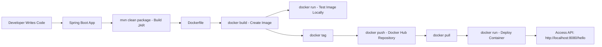

# 🚀 Docker Demo — Spring Boot + Docker
A simple **Spring Boot REST API** packaged and deployed using **Docker**. This project demonstrates how to build, containerize, push, and run a Java application using Docker.

---

## 🧩 Architecture Diagram


---

## 📦 Project Overview
This project contains:
- A simple Spring Boot REST API
- Dockerfile to containerize the application
- Steps to build, tag, push, and run the Docker container

### ✔ REST Controller
```java
package com.praveen.docker_demo;

import org.springframework.web.bind.annotation.GetMapping;
import org.springframework.web.bind.annotation.RestController;

@RestController
public class DockerDemoController {
    @GetMapping("/dockerDemo")
    public String getDemo() {
        return "Spring Boot App is Dockerized successfully";
    }
}

```

---

## 🐳 Docker Setup Instructions

### **1. Build the JAR**
```sh
mvn clean package
```

### **2. Build Docker Image**
```sh
C:\Users\prave\Downloads\docker-demo\docker-demo>docker build .
C:\Users\prave\Downloads\docker-demo\docker-demo>docker images
REPOSITORY            TAG       IMAGE ID       CREATED         SIZE
<none>                <none>    2dfd3c8e5383   5 minutes ago   744MB
mongo                 7.0       542095b95175   13 days ago     1.13GB
mongo                 latest    7245ffb851d1   13 days ago     1.24GB
testcontainers/ryuk   0.11.0    2eaec4fc2cf1   13 months ago   28.3MB

```

### **3. Tag the Image**
```sh
In this stage we have to change empty <none> tag to docker-demo-image1:tag1—this is a name of the tag & image
C:\Users\prave\Downloads\docker-demo\docker-demo>docker build -t docker-demo-image1:tag1 .
C:\Users\prave\Downloads\docker-demo\docker-demo>docker images
REPOSITORY            TAG       IMAGE ID       CREATED          SIZE
docker-demo-image1    tag1      b4fa24032ab0   15 minutes ago   744MB
<none>                <none>    2dfd3c8e5383   15 minutes ago   744MB
```
### **4. Run Spring Boot Application**
```
We have to run our Spring Boot Application on docker run -p 8080:8080 docker-demo-image1:tag1
After running the Spring Boot App we can see on browser http://localhost:8080/dockerDemo
If the output is displayed on the browser upon running the application and it executes successfully, we can conclude 
that our Spring Boot application is properly integrated with Docker.
C:\Users\prave\Downloads\docker-demo\docker-demo>docker run -p 8080:8080 docker-demo-image1:tag1
.   ____          _            __ _ _
 /\\ / ___'_ __ _ _(_)_ __  __ _ \ \ \ \
( ( )\___ | '_ | '_| | '_ \/ _` | \ \ \ \
 \\/  ___)| |_)| | | | | || (_| |  ) ) ) )
  '  |____| .__|_| |_|_| |_\__, | / / / /
 =========|_|==============|___/=/_/_/_/

 :: Spring Boot ::               (v3.4.12)

```


### **5. Access Docker Hub**
```
Access Docker Hub, log into your account, and then navigate to the repository.
Int this stage we change the previous docker image/tag to -> new docker image/tag name with repository
C:\Users\prave\Downloads\docker-demo\docker-demo>docker tag docker-demo-image1:tag1 praveen799/dockerdemo-image:tag12
C:\Users\prave\Downloads\docker-demo\docker-demo>docker images
REPOSITORY                       TAG       IMAGE ID       CREATED          SIZE
docker-demo-image1               tag1      b4fa24032ab0   48 minutes ago   744MB
praveen799/docker-demo-image     tag12     b4fa24032ab0   48 minutes ago   744MB
```
### **6. Push to Docker Hub**
```
It is necessary to upload the Docker image to Docker Hub; at that point, both the Docker Hub and the 
Docker image will be visible
C:\Users\prave\Downloads\docker-demo\docker-demo>docker push praveen799/docker-demo-image:tag12
The push refers to repository [docker.io/praveen799/docker-demo-image]
a3e94e815848: Pushed
17e2e357ea9b: Pushed
7934f821253e: Pushed
2dda2d890763: Pushed
0a2eeedbb6c1: Pushed
tag12: digest: sha256:b4fa24032ab06045669aa2fc6928eb85e4b164b29ac3fd6cc4aa428797c58531 size: 856
```


### **7. Docker Remove**
```
At this stage, we are removing the existing Docker image.
Cmd- docker rmi praveen799/docker-demo-image:tag12
C:\Users\prave\Downloads\docker-demo\docker-demo>docker rmi praveen799/docker-demo-image:tag12
Untagged: praveen799/docker-demo-image:tag12 → Now image was removed
Subsequently, it is necessary to verify whether it exists or not. Now, if we observe the repo/tag successfully removed
C:\Users\prave\Downloads\docker-demo\docker-demo>docker images
REPOSITORY                       TAG       IMAGE ID       CREATED          SIZE
<none>                           <none>    2dfd3c8e5383   56 minutes ago   744MB
docker-demo-image1               tag1      b4fa24032ab0   56 minutes ago   744MB
```

## **8. Pull the Docker Image**
```
we have to pull that removed repository/tag with - docker pull praveen799/docker-demo-image:tag12
C:\Users\prave\Downloads\docker-demo\docker-demo>docker pull praveen799/docker-demo-image:tag12
tag12: Pulling from praveen799/docker-demo-image
Digest: sha256:b4fa24032ab06045669aa2fc6928eb85e4b164b29ac3fd6cc4aa428797c58531
Status: Downloaded newer image for praveen799/docker-demo-image:tag12
docker.io/praveen799/docker-demo-image:tag12

C:\Users\prave\Downloads\docker-demo\docker-demo>docker images
REPOSITORY                       TAG       IMAGE ID       CREATED             SIZE
<none>                           <none>    2dfd3c8e5383   About an hour ago   744MB
docker-demo-image1               tag1      b4fa24032ab0   About an hour ago   744MB
praveen799/docker-demo-image     tag12     b4fa24032ab0   About an hour ago   744MB

```

### **9. Run Container**
```
Final Step we have to verify again whether the Spring boot app is working or not
C:\Users\prave\Downloads\docker-demo\docker-demo>docker run -p 8080:8080 praveen799/docker-demoimage:tag12
.   ____          _            __ _ _
 /\\ / ___'_ __ _ _(_)_ __  __ _ \ \ \ \
( ( )\___ | '_ | '_| | '_ \/ _` | \ \ \ \
 \\/  ___)| |_)| | | | | || (_| |  ) ) ) )
  '  |____| .__|_| |_|_| |_\__, | / / / /
 =========|_|==============|___/=/_/_/_/

 :: Spring Boot ::               (v3.4.12)

2025-12-03T07:39:46.907Z  INFO 1 --- [docker-demo] [           main] c.p.docker_demo.DockerDemoApplication    : Starting DockerDemoApplication v0.0.1-SNAPSHOT using Java 17.0.17 with PID 1 (/app/docker-demo.jar started by root in /app)
2025-12-03T07:39:46.913Z  INFO 1 --- [docker-demo] [           main] c.p.docker_demo.DockerDemoApplication    : No active profile set, falling back to 1 default profile: "default"
2025-12-03T07:39:48.968Z  INFO 1 --- [docker-demo] [           main] o.s.b.w.embedded.tomcat.TomcatWebServer  : Tomcat initialized with port 8080 (http)
2025-12-03T07:39:48.995Z  INFO 1 --- [docker-demo] [           main] o.apache.catalina.core.StandardService   : Starting service [Tomcat]
2025-12-03T07:39:48.996Z  INFO 1 --- [docker-demo] [           main] o.apache.catalina.core.StandardEngine    : Starting Servlet engine: [Apache Tomcat/10.1.49]
2025-12-03T07:39:49.059Z  INFO 1 --- [docker-demo] [           main] o.a.c.c.C.[Tomcat].[localhost].[/]       : Initializing Spring embedded WebApplicationContext
2025-12-03T07:39:49.061Z  INFO 1 --- [docker-demo] [           main] w.s.c.ServletWebServerApplicationContext : Root WebApplicationContext: initialization completed in 1983 ms
2025-12-03T07:39:49.861Z  INFO 1 --- [docker-demo] [           main] o.s.b.w.embedded.tomcat.TomcatWebServer  : Tomcat started on port 8080 (http) with context path '/'
2025-12-03T07:39:49.943Z  INFO 1 --- [docker-demo] [           main] c.p.docker_demo.DockerDemoApplication    : Started DockerDemoApplication in 4.222 seconds (process running for 5.89)
2025-12-03T07:39:59.198Z  INFO 1 --- [docker-demo] [nio-8080-exec-1] o.a.c.c.C.[Tomcat].[localhost].[/]       : Initializing Spring DispatcherServlet 'dispatcherServlet'
2025-12-03T07:39:59.199Z  INFO 1 --- [docker-demo] [nio-8080-exec-1] o.s.web.servlet.DispatcherServlet        : Initializing Servlet 'dispatcherServlet'
2025-12-03T07:39:59.200Z  INFO 1 --- [docker-demo] [nio-8080-exec-1] o.s.web.servlet.DispatcherServlet        : Completed initialization in 1 ms
```

## 10. 🌐 Access the API
Open in your browser:
```
http://localhost:8080/dockerDemo
```

---

## 🐳 Docker Commands Cheat Sheet
### Basic Commands
```
docker --version
docker ps
docker ps -a
docker images
docker rm <container-id>
docker rmi <image-id>
```

### Image Operations
```
docker build -t name:tag .
docker tag local-image username/repo:tag
docker push username/repo:tag
```

### Running Containers
```
docker run -p 8080:8080 image:tag
docker stop <container-id>
docker logs <container-id>
```

---

## 🤝 Contribution
Feel free to fork and contribute.

---

## 📄 License
MIT License.

## B Praveen Kumar
